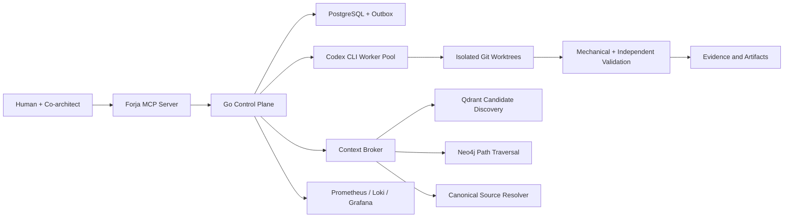

# Forja

Forja is an open architecture and implementation roadmap for a governed
multi-agent software factory.

It is designed around one principle:

> Agents may propose and execute work, but deterministic contracts decide what
> is authorized, valid, durable, and complete.

## Status

This repository is currently a **public architecture and planning project**.
It does not yet claim to provide a production-ready runtime.

The first implementation target is a Go control plane that coordinates Codex
CLI workers through explicit contracts, isolated Git worktrees, PostgreSQL
state, and auditable evidence.

Current planning release: [`v0.1.0`](https://github.com/rvbernucci/forja-guide/releases/tag/v0.1.0).

## Architecture



## Data Responsibilities

| System | Responsibility |
| --- | --- |
| PostgreSQL | Transactional truth, runs, approvals, events, leases, memory metadata, and projection state |
| Object storage | Large immutable artifacts, transcripts, patches, reports, and evidence bundles |
| Qdrant | Semantic and lexical candidate discovery |
| Neo4j | Proven relationships, lineage, impact analysis, and bounded graph paths |
| Git | Versioned source code and documentation truth |
| Prometheus, Loki, Grafana | Metrics, logs, traces, and operational visibility |

Qdrant discovers candidates. Neo4j connects entities. Deterministic extractors,
source code, schemas, tests, and runtime receipts establish authority.

## Repository Map

| Path | Purpose |
| --- | --- |
| [`docs/01-vision`](docs/01-vision/) | Product vision, principles, and scope |
| [`docs/02-architecture`](docs/02-architecture/) | System, data, context, runtime, security, and observability architecture |
| [`docs/03-contracts`](docs/03-contracts/) | Contract model and schema guidance |
| [`docs/04-roadmap`](docs/04-roadmap/) | Master plan and Sprint checklists |
| [`docs/05-decisions`](docs/05-decisions/) | Architecture Decision Records |
| [`docs/06-operations`](docs/06-operations/) | Development and operating procedures |
| [`docs/07-evaluations`](docs/07-evaluations/) | Quality, safety, retrieval, and resilience evaluation strategy |
| [`schemas`](schemas/) | Language-neutral JSON Schema contracts |

See [CHANGELOG.md](CHANGELOG.md) for public release history.

## Initial Technology Direction

- **Go** for the daemon, scheduler, MCP server, process supervisor, and control
  plane.
- **PostgreSQL** as the operational system of record.
- **Object storage** for large immutable content.
- **Qdrant** for governed hybrid retrieval.
- **Neo4j** for deterministic and curated graph traversal.
- **Compiler-specific indexers** for code lineage.
- **Prometheus, Loki, Grafana, and OpenTelemetry** for observability.
- **TypeScript or Python adapters** only where their ecosystems provide a
  concrete advantage.

See the [system architecture](docs/02-architecture/SYSTEM_ARCHITECTURE.md) and
[master development plan](docs/04-roadmap/MASTER_DEVELOPMENT_PLAN.md).

## Quality Gate

Run:

```bash
make validate
```

The validator checks required public files, JSON schemas, internal Markdown
links, forbidden private paths, and common credential patterns.

## Contributing

Read [CONTRIBUTING.md](CONTRIBUTING.md), [GOVERNANCE.md](GOVERNANCE.md), and
[SECURITY.md](SECURITY.md) before proposing changes.

## License

Licensed under the [Apache License 2.0](LICENSE).
