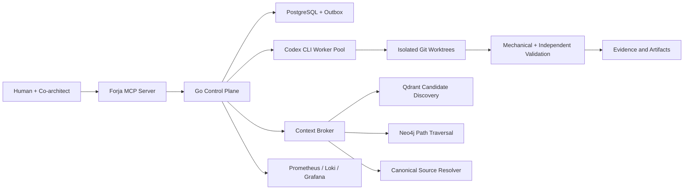

# Forja

Forja is an open architecture and implementation roadmap for a governed
multi-agent software factory.

It is designed around one principle:

> Agents may propose and execute work, but deterministic contracts decide what
> is authorized, valid, durable, and complete.

## Status

This repository includes the authoritatively closed **Sprint 08 deterministic
indexing plane** and the implementation-complete **Sprint 09 governed retrieval
foundation** alongside the public architecture and roadmap. Sprint 09 private
quality activation is explicitly transferred to the Radeon Runtime and
Retrieval Evidence Sprint; production retrieval remains disabled until those
gates pass. Sprint state is recorded by the mutually exclusive
candidate or receipt in [`docs/evidence`](docs/evidence/); only an authoritative
close receipt closes a Sprint and authorizes its successor. It is not yet a
production-ready multi-agent runtime.

The implemented kernel provides `forjad`, `forja`, canonical contract
validation, a deterministic run state machine, PostgreSQL-backed aggregates and
events, command idempotency, fenced leases, a transactional outbox, projection
replay, repository-scoped authority, semantic schema readiness, backup/restore
tooling, structured redacted logs, graceful shutdown, and reproducible Linux
builds. Its legacy kernel HTTP surface is bearer-authenticated, scope-bound,
and derives audit identity only from server configuration. The official Go MCP
SDK powers an authenticated stdio server with eight
typed, audited tools for Sprint planning, submission, decisions, inspection,
cancellation, and resumption. The Go worker runner now executes Codex CLI in an
independent process group with sanitized environment, sandbox write roots
derived from declared task scopes, bounded runtime and output,
schema-constrained reports, deterministic result classification, and fenced
PostgreSQL attempt recovery. The isolated-delivery library now creates
supervisor-owned commits, performs mechanical and independent clean-checkout
validation, persists content-addressed evidence, and publishes only a
namespaced Git ref through a PostgreSQL-journaled compare-and-swap protocol.
`internal/execution` now composes an approved queued Run, its exact fenced
durable attempt, the real worker supervisor, isolated Git delivery,
independent validation, and receipt-backed publication. Before mutation, an
independent human approves the complete delivery envelope; its immutable event
and SHA-256 bind the base commit, scopes, budgets, identities, validators, and
publication target. A dual scheduler/delivery lease heartbeat cancels work on
lost authority, while persisted evidence and the publication journal support
bounded restart recovery without database editing. Every delivery attempt has
its own immutable human authorization, and completed recovery re-observes the
exact Git ref while retrying idempotent lease release. The publication fence
rejects contradictory Run transitions from journal
preparation until the published delivery closes as `completed`. Its full
approval-to-publication path is exercised against PostgreSQL and real child
processes. A public scheduler/MCP delivery command remains outside Sprint 05.
Sprint 04 is not a production
confidentiality boundary: workers require a dedicated disposable host until
separate-identity containment and credential brokerage close the documented
Sprint 12 gate.

The closed Sprint 06 plane adds W3C-propagated OpenTelemetry traces across
MCP, HTTP, scheduler, worker, validation, delivery, and PostgreSQL boundaries;
closed-label Prometheus metrics; context-derived trace IDs in redacted JSON
logs; and a read-only operational collector for stuck work, leases, outbox,
projection lag, approvals, and crash loops. A pinned local Prometheus, Loki,
Alloy, Tempo, and Grafana profile provides alerts and a runtime dashboard.
Telemetry remains disposable and cannot authorize or alter canonical state.

The closed Sprint 07 plane adds content-addressed S3-compatible storage behind an
operator-bound adapter, a PostgreSQL-journaled publication and reconciliation
saga, immutable evidence manifests, conversations and message references,
human- or policy-governed memory promotion, and tombstone-before-purge
retention. Bodies are fully re-read and SHA-256 verified before canonical
activation. A two-plane restore drill recovered a three-object evidence bundle
into a new PostgreSQL database and a separate MinIO data directory, then
revalidated the complete bodies, schema, events, outbox, and command receipts.
The committed `scripts/rehearse_artifact_restore.sh` runner reproduces that
two-plane drill with isolated temporary authority and a provider capability
probe. Artifact references serialize against retention, physical purge binds
the recorded ETag and provider version, transcript artifact bytes bind the
canonical final message inventory, and policy memory promotion requires an explicitly
configured principal with dedicated permission.
Its protocol-v2 close receipt is published under `docs/evidence/sprint-07`.

The closed Sprint 08 plane adds committed-Git extraction for Go, TypeScript,
JavaScript, and Python; strict file, symbol, relation, and lineage contracts;
deterministic incremental invalidation; immutable snapshot artifacts; and an
atomic PostgreSQL event/outbox publication boundary. `forja-index` composes the
complete Git-to-object-store-to-PostgreSQL path, loads its active baseline, and
reuses an adapter only when its descriptor and every owned source file remain
exact. A two-commit command drill proves selective adapter reuse and validates
the resulting events, outbox records, and receipts. Sprint 09 now adds strict
retrieval contracts, deterministic symbol cards and sparse lexical vectors,
independent fenced projection delivery, a Qdrant point writer with mandatory
pre-ranking filters, a live hybrid candidate query path, and a fail-closed canonical-resolution boundary. The
symbol projector writes Qdrant first, records canonical point provenance in
PostgreSQL, and only then acknowledges its fenced delivery. The operator
adapter can create physical collections, apply required payload indexes, and
verify physical generation, vector dimensions, strict filtering and payload
indexes, then atomically switch a verified alias. Live blue-green cutover,
guarded rollback, derived-store deletion/replay, and a schema-validated offline
evaluation harness are implemented. The retrieval plane now also includes a
Bedrock Titan v2 adapter using the AWS SDK for Go v2 and the standard AWS
credential chain, plus bounded `forja-retrieval project-once` and
`forja-retrieval query` commands. A bounded `forja-retrieval capture` command
can execute the four required hybrid-search baselines from a private,
label-free plan and produce a schema-validated comparison for offline scoring;
private labels remain outside the runtime. Decision cards are re-derived from their
canonical rows. Memory cards require an active canonical memory, an active
exact artifact/object binding, a verified object version, and a bounded,
redacted derived body before they can be projected or resolved. Runtime
operations require PostgreSQL readiness, a verified Qdrant endpoint, the
governed S3 configuration, and standard AWS credential configuration; they
never accept secrets as flags or write query text to receipts. Production
activation still requires a workload-role deployment, region/model-access
evidence, and private evaluation results. Incident cards now derive only from
the matching immutable terminal attempt event and retain classification,
severity, identifiers, and evidence hashes, never worker output. Neo4j
traversal remains pending for the graph-grounded context work in Sprint 11.
Sprints 10-14 now complete Forja Alpha for AMD AI DevMaster Track 2: canonical
point-in-time financial data, local ROCm model and embedding inference,
deterministic analytical tools, graph-grounded RAG, multi-step planning,
governed memory and permissions, measurable optimization, and a reproducible
public submission. Sprint 10 has started the Alpha data plane with an initial
PostgreSQL schema for financial sources, filings, XBRL facts, time series,
holdings, analysis lineage, research sessions, and claim evidence. It also
includes a deterministic SEC identity seed for the Magnificent Seven issuer,
security, CIK, and ticker authority.

When a canonical snapshot is superseded, the projector first tombstones every
affected PostgreSQL retrieval receipt and only then asks Qdrant to delete the
corresponding stable point IDs. A failed derived delete remains fail-closed:
the still-present vector cannot resolve through canonical authority.

The pinned local Qdrant profile and canonical rebuild procedure are documented
in [`docs/06-operations/QDRANT_RECOVERY_RUNBOOK.md`](docs/06-operations/QDRANT_RECOVERY_RUNBOOK.md).

Current planning release: [`v0.1.0`](https://github.com/rvbernucci/forja-guide/releases/tag/v0.1.0).

## Forja Alpha Experience Preview

Forja Alpha is the first bounded domain specialization of the Forja runtime: a
private investment-research workspace for source-grounded fundamental,
factor-sensitivity, and institutional-disclosure analysis. Its current
experience foundation serves a responsive web interface, versioned API,
runtime-readiness state, and deterministic evidence plan from one Go binary.
It does not yet execute financial analysis and never simulates a result while
the local ROCm, data, retrieval, and analytical adapters are unavailable.

```bash
make alpha-run
```

Open `http://127.0.0.1:8787`. See the [architecture](docs/02-architecture/FORJA_ALPHA.md),
[data architecture](docs/02-architecture/FORJA_ALPHA_DATA_ARCHITECTURE.md), and
[local operation guide](docs/06-operations/FORJA_ALPHA_LOCAL.md).

## Architecture



## Data Responsibilities

| System | Responsibility |
| --- | --- |
| PostgreSQL | Transactional truth, runs, approvals, events, leases, memory metadata, and projection state |
| Object storage | Large immutable artifacts, transcripts, patches, reports, and evidence bundles |
| Qdrant | Semantic and lexical candidate discovery |
| Neo4j | Proven relationships, lineage, impact analysis, and bounded graph paths |
| Git | Versioned source code and documentation truth |
| Prometheus, Loki, Grafana | Metrics, logs, traces, and operational visibility |

Qdrant discovers candidates. Neo4j connects entities. Deterministic extractors,
source code, schemas, tests, and runtime receipts establish authority.

## Repository Map

| Path | Purpose |
| --- | --- |
| [`docs/01-vision`](docs/01-vision/) | Product vision, principles, and scope |
| [`docs/02-architecture`](docs/02-architecture/) | System, data, context, runtime, security, and observability architecture |
| [`docs/03-contracts`](docs/03-contracts/) | Contract model and schema guidance |
| [`docs/04-roadmap`](docs/04-roadmap/) | Master plan and Sprint checklists |
| [`docs/05-decisions`](docs/05-decisions/) | Architecture Decision Records |
| [`docs/06-operations`](docs/06-operations/) | Development and operating procedures |
| [`docs/07-evaluations`](docs/07-evaluations/) | Quality, safety, retrieval, and resilience evaluation strategy |
| [`schemas`](schemas/) | Language-neutral JSON Schema contracts |
| [`cmd/forjad`](cmd/forjad/) | Experimental Go daemon |
| [`cmd/forja`](cmd/forja/) | Experimental command-line client |
| [`cmd/forja-index`](cmd/forja-index/) | Committed-source deterministic indexing publisher |
| [`cmd/forja-mcp`](cmd/forja-mcp/) | Governed MCP stdio control surface |
| [`cmd/forja-alpha`](cmd/forja-alpha/) | Embedded local web experience for the Forja Alpha vertical |
| [`cmd/forja-worker`](cmd/forja-worker/) | Bounded one-shot Codex worker runner |
| [`cmd/forja-retrieval-eval`](cmd/forja-retrieval-eval/) | Offline, schema-validated retrieval evaluation reporter |
| [`cmd/forja-retrieval`](cmd/forja-retrieval/) | Bounded governed projection, query, and private baseline-capture operations |
| [`internal/execution`](internal/execution/) | Approved Run-to-worker-to-publication orchestration |
| [`internal/delivery`](internal/delivery/) | Isolated worktrees, deterministic commits, validation, evidence, and controlled publication |
| [`internal/observability`](internal/observability/) | Fail-soft traces, bounded metrics, stable failure taxonomy, and operational state collector |
| [`internal/knowledge`](internal/knowledge/) | Governed artifact publication, reconciliation, and retention orchestration |
| [`internal/objectstore`](internal/objectstore/) | Conditional content-addressed S3 publication and full-body verification |
| [`internal/indexing`](internal/indexing/) | Git boundary, language adapters, contracts, lineage, and invalidation |
| [`internal/indexservice`](internal/indexservice/) | Artifact-first canonical index publication saga |
| [`deploy/observability`](deploy/observability/) | Version-pinned local Prometheus, Loki, Alloy, Tempo, and Grafana stack |

See [CHANGELOG.md](CHANGELOG.md) for public release history.

Sprint 10 Radeon Cloud setup starts from the
[Radeon runtime procedure](docs/06-operations/RADEON_CLOUD_RUNTIME.md). Its
sanitized environment receipt is generated by
[`scripts/capture_radeon_runtime_receipt.py`](scripts/capture_radeon_runtime_receipt.py)
and validated against
[`schemas/radeon-runtime-receipt.schema.json`](schemas/radeon-runtime-receipt.schema.json).

## MCP Quick Start

```bash
go build -trimpath -o "$HOME/.local/bin/forja-mcp" ./cmd/forja-mcp
codex mcp add forja \
  --env FORJA_MCP_ACTOR_ID=codex-co-architect \
  -- "$HOME/.local/bin/forja-mcp"
```

Add `FORJA_DATABASE_URL` through an approved secret boundary for durable state.
Without it, each MCP process uses explicit ephemeral state. See the [MCP
control API](docs/03-contracts/MCP_CONTROL_API.md).

The default `agent` principal may plan, inspect, submit, and cancel work, but it
cannot approve decisions or resume execution. Those capabilities require a
separately authenticated `human` or `system` control boundary; model output
cannot authorize its own execution.

The lower-level `forjad`/`forja` HTTP path is also fail-closed. Set
`FORJA_HTTP_BEARER_TOKEN` and `FORJA_HTTP_ACTOR_ID` in both process
environments; health, readiness, and version are the only anonymous endpoints.
See the [local development guide](docs/06-operations/LOCAL_DEVELOPMENT.md).

## Initial Technology Direction

- **Go** for the daemon, scheduler, MCP server, process supervisor, and control
  plane.
- **PostgreSQL** as the operational system of record.
- **Object storage** for large immutable content.
- **Qdrant** for governed hybrid retrieval.
- **Neo4j** for deterministic and curated graph traversal.
- **Compiler-specific indexers** for code lineage.
- **Prometheus, Loki, Grafana, and OpenTelemetry** for observability.
- **TypeScript or Python adapters** only where their ecosystems provide a
  concrete advantage.

See the [system architecture](docs/02-architecture/SYSTEM_ARCHITECTURE.md) and
[master development plan](docs/04-roadmap/MASTER_DEVELOPMENT_PLAN.md).

## Quality Gate

Run:

```bash
make validate
```

The gate runs Go formatting, module, vet, unit, race, reproducible build, and
process-level smoke checks before validating public files, JSON schemas,
internal Markdown links, private paths, and common credential patterns.

With a disposable PostgreSQL database available, run the durability,
approval-to-publication, rollback compatibility, concurrency, backup/restore,
and process-restart acceptance suite:

```bash
export FORJA_TEST_DATABASE_URL='postgres:///forja_test?host=/tmp'
make test-integration
```

## Contributing

Read [CONTRIBUTING.md](CONTRIBUTING.md), [GOVERNANCE.md](GOVERNANCE.md), and
[SECURITY.md](SECURITY.md) before proposing changes.

## License

Licensed under the [Apache License 2.0](LICENSE).
