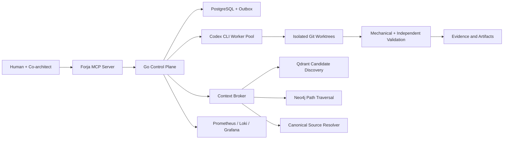

# Forja

Forja is an open architecture and implementation roadmap for a governed
multi-agent software factory.

It is designed around one principle:

> Agents may propose and execute work, but deterministic contracts decide what
> is authorized, valid, durable, and complete.

## Status

This repository now includes the **Sprint 03 experimental governed control plane**
alongside the public architecture and roadmap. It is not yet a production-ready
multi-agent runtime.

The implemented kernel provides `forjad`, `forja`, canonical contract
validation, a deterministic run state machine, PostgreSQL-backed aggregates and
events, command idempotency, fenced leases, a transactional outbox, projection
replay, repository-scoped authority, semantic schema readiness, backup/restore
tooling, structured redacted logs, graceful shutdown, and reproducible Linux
builds. The official Go MCP SDK powers an authenticated stdio server with eight
typed, audited tools for Sprint planning, submission, decisions, inspection,
cancellation, and resumption. Codex worker execution remains planned for Sprint
04.

Current planning release: [`v0.1.0`](https://github.com/rvbernucci/forja-guide/releases/tag/v0.1.0).

## Architecture



## Data Responsibilities

| System | Responsibility |
| --- | --- |
| PostgreSQL | Transactional truth, runs, approvals, events, leases, memory metadata, and projection state |
| Object storage | Large immutable artifacts, transcripts, patches, reports, and evidence bundles |
| Qdrant | Semantic and lexical candidate discovery |
| Neo4j | Proven relationships, lineage, impact analysis, and bounded graph paths |
| Git | Versioned source code and documentation truth |
| Prometheus, Loki, Grafana | Metrics, logs, traces, and operational visibility |

Qdrant discovers candidates. Neo4j connects entities. Deterministic extractors,
source code, schemas, tests, and runtime receipts establish authority.

## Repository Map

| Path | Purpose |
| --- | --- |
| [`docs/01-vision`](docs/01-vision/) | Product vision, principles, and scope |
| [`docs/02-architecture`](docs/02-architecture/) | System, data, context, runtime, security, and observability architecture |
| [`docs/03-contracts`](docs/03-contracts/) | Contract model and schema guidance |
| [`docs/04-roadmap`](docs/04-roadmap/) | Master plan and Sprint checklists |
| [`docs/05-decisions`](docs/05-decisions/) | Architecture Decision Records |
| [`docs/06-operations`](docs/06-operations/) | Development and operating procedures |
| [`docs/07-evaluations`](docs/07-evaluations/) | Quality, safety, retrieval, and resilience evaluation strategy |
| [`schemas`](schemas/) | Language-neutral JSON Schema contracts |
| [`cmd/forjad`](cmd/forjad/) | Experimental Go daemon |
| [`cmd/forja`](cmd/forja/) | Experimental command-line client |
| [`cmd/forja-mcp`](cmd/forja-mcp/) | Governed MCP stdio control surface |

See [CHANGELOG.md](CHANGELOG.md) for public release history.

## MCP Quick Start

```bash
go build -trimpath -o "$HOME/.local/bin/forja-mcp" ./cmd/forja-mcp
codex mcp add forja \
  --env FORJA_MCP_ACTOR_ID=codex-co-architect \
  -- "$HOME/.local/bin/forja-mcp"
```

Add `FORJA_DATABASE_URL` through an approved secret boundary for durable state.
Without it, each MCP process uses explicit ephemeral state. See the [MCP
control API](docs/03-contracts/MCP_CONTROL_API.md).

The default `agent` principal may plan, inspect, submit, and cancel work, but it
cannot approve decisions or resume execution. Those capabilities require a
separately authenticated `human` or `system` control boundary; model output
cannot authorize its own execution.

## Initial Technology Direction

- **Go** for the daemon, scheduler, MCP server, process supervisor, and control
  plane.
- **PostgreSQL** as the operational system of record.
- **Object storage** for large immutable content.
- **Qdrant** for governed hybrid retrieval.
- **Neo4j** for deterministic and curated graph traversal.
- **Compiler-specific indexers** for code lineage.
- **Prometheus, Loki, Grafana, and OpenTelemetry** for observability.
- **TypeScript or Python adapters** only where their ecosystems provide a
  concrete advantage.

See the [system architecture](docs/02-architecture/SYSTEM_ARCHITECTURE.md) and
[master development plan](docs/04-roadmap/MASTER_DEVELOPMENT_PLAN.md).

## Quality Gate

Run:

```bash
make validate
```

The gate runs Go formatting, module, vet, unit, race, reproducible build, and
process-level smoke checks before validating public files, JSON schemas,
internal Markdown links, private paths, and common credential patterns.

With a disposable PostgreSQL database available, run the durability,
concurrency, backup/restore, and process-restart acceptance suite:

```bash
export FORJA_TEST_DATABASE_URL='postgres:///forja_test?host=/tmp'
make test-integration
```

## Contributing

Read [CONTRIBUTING.md](CONTRIBUTING.md), [GOVERNANCE.md](GOVERNANCE.md), and
[SECURITY.md](SECURITY.md) before proposing changes.

## License

Licensed under the [Apache License 2.0](LICENSE).
