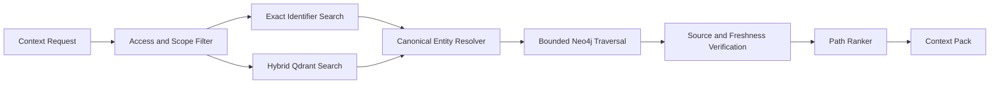

# Context Broker

Status: Proposed

## Purpose

The Context Broker produces the smallest evidence-backed context pack that can
safely support a task.

It does not ask a vector database to answer the task. It coordinates exact
lookup, semantic discovery, entity resolution, graph traversal, source
verification, and token budgeting.

## Pipeline



## Retrieval Stages

1. **Scope:** apply tenant, repository, branch, commit, role, and sensitivity
   boundaries before retrieval.
2. **Exact search:** resolve paths, symbols, routes, schema names, commands, and
   identifiers lexically.
3. **Semantic search:** retrieve conceptually relevant artifacts and symbol
   cards from Qdrant.
4. **Entity resolution:** map candidates to stable canonical IDs and reject
   stale or ambiguous results.
5. **Graph traversal:** connect starting entities to tests, docs, owners,
   dependencies, data fields, and evidence using allowlisted path templates.
6. **Verification:** confirm source hashes, commit compatibility, and projection
   freshness.
7. **Ranking:** optimize authority, path coverage, freshness, diversity, and
   token cost.
8. **Packing:** emit a bounded context pack with explicit gaps and citations.

## Google Maps Analogy

- The user request is the desired journey.
- Qdrant proposes relevant landmarks.
- Exact lookup identifies known addresses.
- Entity resolution places each landmark on the canonical map.
- Neo4j finds valid roads between them.
- The path ranker chooses a route under risk and token constraints.
- Source verification checks that the roads still exist.

## Ranking

The first implementation should use an explainable weighted policy:

```text
score =
  authority
  + path_coverage
  + exact_match
  + freshness
  + evidence_strength
  + source_diversity
  - ambiguity
  - staleness
  - token_cost
```

Weights must be learned or adjusted against evaluation datasets, but every
component remains visible in the context receipt.

## Context Pack

A context pack contains:

- request and scope identifiers;
- selected entities and paths;
- minimal excerpts;
- source hashes and commits;
- authority and freshness state;
- required invariants;
- allowed tools or commands;
- expected evidence;
- open gaps;
- token estimate;
- retrieval receipt.

The context pack is an input artifact. It does not authorize writes.

## Failure Behavior

- Ambiguous entity resolution returns alternatives instead of inventing a link.
- Stale graph or vector projections fall back to canonical source search.
- Missing graph paths become explicit gaps.
- Token overflow triggers deterministic pruning, not silent truncation.
- Retrieval service failure must not corrupt run state.

