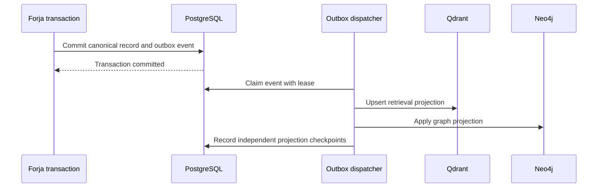

# Data Architecture

Status: Proposed

## Decision

Forja uses polyglot persistence with a single operational authority:

> PostgreSQL records. Object storage preserves. Qdrant discovers. Neo4j
> connects. Source code and evidence prove.

## Store Responsibilities

### PostgreSQL

PostgreSQL is the system of record for:

- organizations, tenants, repositories, and identities;
- Sprints, tasks, dependencies, and acceptance criteria;
- runs, attempts, state transitions, retries, and cancellations;
- agents, workers, sessions, capabilities, and budgets;
- approvals, grants, policies, and denials;
- file leases, worktree leases, and idempotency keys;
- artifact metadata, versions, hashes, and provenance;
- conversations, messages, memory records, and citations;
- outbox events and projection checkpoints;
- evaluation cases, outcomes, and release evidence.

Stable relational columns hold identity, lifecycle, authorization, and query
keys. `JSONB` is reserved for versioned payloads whose shape legitimately
varies, such as model metadata or tool-specific evidence.

### Object Storage

Object storage contains large or immutable bodies:

- complete chat transcripts;
- patches and diffs;
- evidence bundles;
- test logs;
- screenshots and recordings;
- PDFs and datasets;
- generated reports;
- model or index snapshots.

PostgreSQL stores the object URI, hash, media type, size, encryption metadata,
retention policy, and provenance.

### Qdrant

Qdrant stores derived retrieval points:

- architecture and decision chunks;
- runbooks, prompts, and skills;
- artifact summaries;
- memory summaries;
- incident and resolution cards;
- code symbol cards;
- test behavior cards;
- specialist routing cards.

Each point carries hard filters:

```text
tenant_id
repository_id
artifact_id
entity_id
source_commit
source_hash
status
authority_class
stale
artifact_family
language
symbol_kind
proof_refs
graph_node_ids
embedding_model
embedding_version
```

Similarity never promotes authority. Qdrant results are candidates that require
canonical entity resolution.

### Neo4j

Neo4j is the graph serving layer for:

- code dependencies;
- type and symbol relationships;
- data and variable lineage;
- test and documentation coverage;
- artifact provenance;
- agent, Sprint, run, and evidence relationships;
- impact analysis;
- bounded paths between retrieved entities.

Neo4j edges must declare their evidence class:

| Evidence class | Example |
| --- | --- |
| `confirmed_static` | Compiler-resolved import, call, or type relation |
| `confirmed_schema` | Database or JSON Schema relationship |
| `confirmed_behavioral` | Test-proven behavior |
| `runtime_observed` | Trace or audited runtime receipt |
| `curated` | Human-reviewed architecture relation |
| `candidate_semantic` | Untrusted semantic suggestion; never authoritative |

## Synchronization

Direct dual or triple writes are forbidden.



Each projection uses:

- stable event ID;
- source aggregate ID and version;
- idempotency key;
- expected source hash;
- independent Qdrant and Neo4j cursor;
- retry count and terminal failure state.

## Chat, Memory, and Study

Use PostgreSQL rather than a general-purpose document database.

Recommended model:

```text
conversation
  -> message
  -> content_part
  -> citation
  -> memory_candidate
  -> memory_record
  -> artifact
```

Memory is not the same as chat history:

- **raw message:** immutable conversation evidence;
- **working summary:** replaceable short-lived context;
- **memory candidate:** proposed durable learning;
- **memory record:** validated durable fact, preference, decision, or lesson;
- **artifact:** versioned deliverable with provenance and evidence.

Only memory records and selected summaries are embedded.

## Retention

- Operational events are append-only.
- Large logs may move to object storage after the hot retention period.
- Qdrant points and Neo4j projections follow source lifecycle and can be
  regenerated.
- Deletion requests produce tombstones and projection delete events.
- Derived stores must never retain content beyond the canonical retention
  policy.

## Why Not Build a Database

Forja needs an intelligence fabric, not a new database engine. Reimplementing
transactions, replication, recovery, indexing, access control, and backup would
consume the project while reducing reliability.

The innovation belongs in the shared identity model, Context Broker,
provenance, projections, routing, and evidence contracts.

