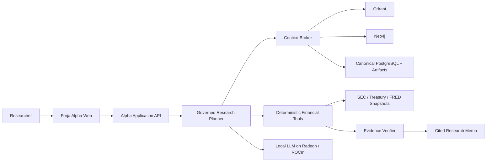

# Forja Alpha

Status: Experience foundation implemented; financial data, local inference,
retrieval, and analytical execution remain gated Sprint 10-13 work.

## Product Boundary

Forja Alpha is the first domain specialization of the neutral Forja runtime. It
is a private investment-research workspace for source-grounded accounting,
fundamental, factor-sensitivity, and institutional-disclosure analysis. It does
not predict prices, place trades, or present historical association as causal
investment advice.

The application reuses Forja governance, retrieval, memory, tool, evidence,
and observability boundaries. Financial behavior stays under `internal/alpha`;
domain-neutral behavior is promoted to the kernel only after another vertical
requires the same contract. This boundary and its local-inference trust policy
are governed by [ADR-0020](../05-decisions/ADR-0020-BOUNDED-ALPHA-VERTICAL.md).

## Implemented Foundation

- `forja-alpha` serves an embedded responsive web interface and versioned JSON
  API from one Go binary.
- The interface exposes the local-runtime state, coverage universe, planned
  capability status, deterministic evidence plan, and explicit gaps.
- Model and embedding endpoints are optional at startup but, when configured,
  must use an explicit loopback address. Remote core inference is rejected as
  required by [ADR-0020](../05-decisions/ADR-0020-BOUNDED-ALPHA-VERTICAL.md).
- Research prompts are bounded, excluded from server logs, held only in the
  process-local preview service, and omitted from research-session responses.
- The preview never fabricates financial results. Until execution adapters are
  complete, it returns an `awaiting_local_runtime` or `planned` evidence plan.

## Target Runtime

Public data may be refreshed from source systems by governed ingestion tools,
but language-model and embedding inference remain local. A recorded demo uses
hash-pinned snapshots so network availability cannot change its result.

## Research Contract

Every completed memo must separate:

1. reported facts and their effective availability timestamps;
2. mechanically recomputed metrics;
3. statistical estimates with sample and uncertainty;
4. model-supported interpretation;
5. counterarguments, conflicts, stale evidence, and unresolved gaps.

The model chooses and explains a bounded analytical plan. Deterministic tools
perform material calculations. No model output establishes canonical facts or
authorizes privileged operations.

## Planned Capability Packs

| Pack | Canonical inputs | Primary tools |
| --- | --- | --- |
| Filings | SEC submissions and XBRL | point-in-time retrieval, filing comparison |
| Fundamentals | canonical reported facts | growth, margin, cash conversion, capital intensity |
| Factors | licensed prices, Treasury and FRED/ALFRED | returns, rolling OLS, Ridge, diagnostics |
| Holdings | SEC Form 13F | change, overlap, concentration, filing-delay disclosure |

See the [AMD Track 2 roadmap](../04-roadmap/SPRINTS_10_14_PRODUCTION.md) for
implementation, evaluation, optimization, and submission gates.
