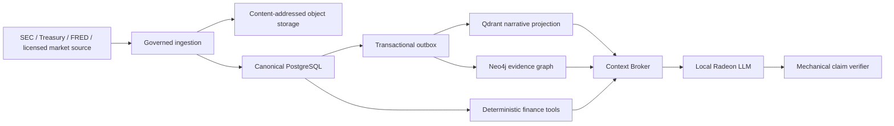

# Forja Alpha Data Architecture

Status: Active for Sprints 10-14. The initial PostgreSQL schema is
implemented in migration `000010_forja_alpha_financial_data`; the Magnificent
Seven SEC identity registry and idempotent SQL seed are implemented in
`forja-alpha seed-identities`, including an optional versioned SEC
`company_tickers.json` snapshot path with source-object lineage. Filing,
Treasury, first FRED/ALFRED, and first market-data snapshot adapters now
preserve source lineage and point-in-time clocks. Populated snapshots and
recovery gates remain Sprint 10 work.

The authority and point-in-time decisions in this design are governed by
[ADR-0021](../05-decisions/ADR-0021-POINT-IN-TIME-FINANCIAL-AUTHORITY.md).

## Purpose

Forja Alpha requires two different kinds of intelligence:

1. exact, point-in-time financial and market observations that must be queried
   and calculated deterministically; and
2. narrative evidence that benefits from semantic discovery and bounded graph
   traversal.

The system keeps those paths separate. Embeddings do not answer accounting or
statistical questions, and language-model output never becomes a source fact.

> PostgreSQL decides. Object storage preserves. Qdrant discovers narrative.
> Neo4j explains proven relationships. Deterministic tools calculate. The local
> model plans and communicates.

## Initial Coverage

The first release is intentionally bounded:

- issuers: Apple, Microsoft, Alphabet, Amazon, NVIDIA, Meta Platforms, Tesla;
- filings: 10-K, 10-Q, relevant amendments, and their primary documents;
- fundamentals: reported and mechanically derived income, cash-flow, balance
  sheet, capital-intensity, dilution, and cash-conversion metrics;
- factors: adjusted daily equity returns and approved market/rate/macro series;
- rates: US Treasury nominal and real yield curves;
- macro: a versioned allowlist of FRED/ALFRED series and vintages;
- holdings: a reviewed allowlist of institutional-manager 13F filings;
- narrative: filing sections, notes, accounting policies, risk disclosures,
  methodology, and generated evidence summaries.

Coverage expands only after the bounded release passes identity, temporal,
quality, license, and recovery gates.

## Minimum Data Products

Sprint 10 does not expose raw tables directly to the agent. It publishes five
versioned data products with independent freshness and quality receipts:

| Product | Content | Primary consumer |
| --- | --- | --- |
| `issuer_filing_timeline` | issuer identity, forms, periods, amendments, availability, and source documents | filing planner and timeline UI |
| `canonical_fundamental_panel` | reviewed reported and derived metrics by issuer and fiscal period | fundamental tools and comparison UI |
| `daily_factor_panel` | adjusted security/benchmark returns plus approved nominal/real rate factors | factor estimation tools |
| `institutional_holdings_panel` | point-in-time 13F reports, resolved positions, and filing-delay metadata | holdings tools |
| `narrative_evidence_corpus` | filing sections, notes, policies, risks, and method documentation | Qdrant and Context Broker |

The initial rate registry includes the Treasury maturities required by the
primary demo, especially the 10-year real yield, and stores level and change as
different derived factors. The initial market registry contains the seven
covered securities plus reviewed broad-market and technology benchmarks from
the licensed adapter. The macro registry begins with policy rate, inflation,
and labor-market series only when their vintage contract is tested.

Each product declares schema version, source-object closure, `as_of` policy,
coverage, row count, null policy, quality status, producer version, and output
hash. A product is unavailable when any required source family is quarantined;
partial coverage is explicit rather than silently filled.

## Source Registry

| Source | Data | Authority and constraints | Acquisition |
| --- | --- | --- | --- |
| SEC company tickers | CIK, ticker, exchange, name | Discovery aid; SEC does not guarantee complete accuracy or scope | Versioned JSON snapshot |
| SEC Submissions API | filing identity and history | Canonical filing metadata for the release | Incremental JSON plus bulk recovery |
| SEC Company Facts and filing XBRL | structured reported facts | Facts remain as filed; full filing controls when conflict exists | Incremental JSON, filing artifacts, nightly bulk recovery |
| SEC filing archives | primary documents and exhibits | Primary narrative and presentation evidence | Content-addressed object snapshot |
| SEC Form 13F datasets/filings | public institutional holdings | Delayed, filer-reported, incomplete view; never current portfolio truth | Quarterly ZIP plus filing verification |
| US Treasury | nominal and real yield curves | Official curve data with methodology/version notes | CSV/XML snapshot |
| FRED/ALFRED | macro series and historical vintages | Series may be revised; source and copyright metadata must be retained | API snapshot with vintage parameters |
| Licensed market adapter | adjusted OHLCV and corporate actions | Provider terms control retention and redistribution | API or hash-pinned licensed CSV |

Official source references:

- [SEC EDGAR APIs](https://www.sec.gov/search-filings/edgar-application-programming-interfaces)
- [SEC EDGAR access guidance](https://www.sec.gov/search-filings/edgar-search-assistance/accessing-edgar-data)
- [SEC Form 13F datasets](https://www.sec.gov/data-research/sec-markets-data/form-13f-data-sets)
- [Treasury daily rates](https://home.treasury.gov/resource-center/data-chart-center/interest-rates/TextView)
- [FRED API](https://fred.stlouisfed.org/docs/api/fred/overview.html)

Market prices are not silently scraped from an undocumented endpoint. The
adapter contract records provider, entitlement, adjustment policy, license,
retrieval timestamp, and redistribution boundary. A user-supplied licensed CSV
is the reproducible fallback.

## SEC Identity Seed and Snapshot Lineage

The bounded release can bootstrap its issuer universe without network access:

```bash
go run ./cmd/forja-alpha seed-identities \
  --tenant-id <tenant-uuid> \
  --repository-id <repository-uuid> \
  > /secure/forja/alpha-sec-identities.sql
```

When an SEC `company_tickers.json` snapshot has been acquired and preserved in
the operator's private artifact area, the same command can bind the bootstrap
to a content hash, ingestion run, and source object:

```bash
go run ./cmd/forja-alpha seed-identities \
  --tenant-id <tenant-uuid> \
  --repository-id <repository-uuid> \
  --company-tickers-json /secure/forja/sec/company_tickers.json \
  --available-at 2026-07-20T12:00:00Z \
  > /secure/forja/alpha-sec-identities.sql
```

The generated SQL is idempotent. It creates the target tenant and repository
scope, registers the SEC EDGAR source system, validates that the snapshot
contains the seven covered tickers with the expected CIKs, records the snapshot
SHA-256 and size in `alpha_source_objects`, records an `alpha_ingestion_runs`
receipt, and upserts the covered issuers, their common-stock securities,
canonical CIK identifiers, and reviewed ticker identifiers.

The company-tickers snapshot remains a discovery and identity aid. It is not a
substitute for SEC submissions, filing archives, Company Facts, and filing
source objects, which remain the authority for reported facts and documents.

## SEC Submissions Snapshot Seed

After issuer identity has been seeded, a preserved SEC submissions snapshot can
populate the initial filing timeline for one covered company:

```bash
go run ./cmd/forja-alpha seed-submissions \
  --tenant-id <tenant-uuid> \
  --repository-id <repository-uuid> \
  --ticker NVDA \
  --submissions-json /secure/forja/sec/submissions/CIK0001045810.json \
  --available-at 2026-07-20T12:00:00Z \
  > /secure/forja/alpha-sec-submissions-nvda.sql
```

The command validates that the snapshot CIK and ticker match the bounded
universe, filters the recent filing table to `10-K`, `10-K/A`, `10-Q`, and
`10-Q/A`, records the submissions JSON as a source object, records an ingestion
run, and upserts `alpha_filings` with accession, form, period end, filing time,
and availability time.

This is a filing-timeline adapter, not a full document or XBRL parser. The
primary filing document, inline XBRL instance, Company Facts payload, and
parsed accounting facts remain separate Sprint 10 ingestion work.

## SEC Company Facts Snapshot Seed

SEC Company Facts snapshots are recorded before Forja attempts canonical metric
mapping:

```bash
go run ./cmd/forja-alpha seed-company-facts \
  --tenant-id <tenant-uuid> \
  --repository-id <repository-uuid> \
  --ticker NVDA \
  --company-facts-json /secure/forja/sec/companyfacts/CIK0001045810.json \
  --available-at 2026-07-20T12:00:00Z \
  > /secure/forja/alpha-sec-companyfacts-nvda.sql
```

The command validates the CIK, records the snapshot SHA-256 and source object,
stores an ingestion receipt, writes a sanitized coverage summary into
source-object metadata, and persists raw XBRL-like rows into
`alpha_taxonomies`, `alpha_xbrl_concepts`, `alpha_xbrl_contexts`, and
`alpha_xbrl_facts`. Coverage metadata includes taxonomy count, concept count,
unit count, fact count, forms, fiscal years, currencies, and canonical metric
hints.

This step deliberately stops before choosing authoritative accounting metrics.
The raw fact rows preserve lexical and numeric values, SEC `decimals`, units,
currency, period start, period end, fiscal frame, filing accession, concept
identity, context hash, and source-object lineage. Metric mapping, dimensional
validation, unit/scale normalization, amendment priority, and
`alpha_metric_observations` remain reviewed Sprint 10 work.

Unsupported taxonomies, missing unit identity, missing numeric monetary values,
invalid currency units, and impossible or missing periods are not discarded.
They are preserved as raw facts with `quality_state='quarantined'` and are
excluded from first-pass metric-observation promotion. This keeps the evidence
auditable without allowing ambiguous source rows to become canonical accounting
truth.

## Canonical Metric Registry Seed

The initial metric registry is seeded after raw facts exist:

```bash
go run ./cmd/forja-alpha seed-metrics \
  --tenant-id <tenant-uuid> \
  --repository-id <repository-uuid> \
  --ticker NVDA \
  > /secure/forja/alpha-metrics-nvda.sql
```

The command creates versioned reported metric definitions for revenue,
operating income, net income, operating cash flow, and capital expenditure. It
also creates issuer-scoped, reviewed US-GAAP concept mappings for the bounded
demo universe. The mappings reference deterministic concept IDs produced by the
Company Facts raw-fact adapter and include the reviewed concept name in the
context filter for auditability.

This registry authorizes candidate normalizations; it still does not select
periods, resolve amendments, derive quarterly values from YTD facts, or create
`alpha_metric_observations`.

## Initial Metric Observation Seed

Mapped numeric Company Facts rows can be promoted into reported metric
observations only after identity, submissions, raw Company Facts, and metric
mappings have been seeded:

```bash
go run ./cmd/forja-alpha seed-metric-observations \
  --tenant-id <tenant-uuid> \
  --repository-id <repository-uuid> \
  --ticker NVDA \
  --company-facts-json /secure/forja/sec/companyfacts/CIK0001045810.json \
  --available-at 2026-07-20T12:00:00Z \
  > /secure/forja/alpha-metric-observations-nvda.sql
```

The command selects only numeric USD raw facts whose concept IDs match reviewed
metric mappings. Each observation keeps the source fact, filing, issuer,
period start, period end, value, unit, currency, fiscal frame, and a lineage
object that states the selection remains
`mapped_raw_fact_only_no_amendment_or_ytd_resolution`.

This is intentionally a first-pass reported observation layer. It does not
deduplicate multiple reported candidates, resolve amendments, infer quarterly
values from YTD rows, or decide issuer-specific custom extensions.
It promotes only mapped, numeric USD facts whose raw quality state is accepted.

## Treasury Series Snapshot Seed

The first macro/rates adapter ingests a hash-pinned local Treasury CSV snapshot
for the 10-year real-yield series:

```bash
go run ./cmd/forja-alpha seed-treasury-series \
  --tenant-id <tenant-uuid> \
  --repository-id <repository-uuid> \
  --csv /secure/forja/treasury/real-yield-10y.csv \
  --available-at 2026-07-20T12:00:00Z \
  > /secure/forja/alpha-treasury-real-yield-10y.sql
```

The CSV must include a date column and a value/rate column. Optional
`published_at` and `vintage_at` columns preserve publication and revision
semantics. The seed records the Treasury source system, source object,
ingestion run, series registry row, and accepted `alpha_series_observations`.
Rows with empty or non-numeric values are counted in source metadata and do
not become canonical observations.

## FRED/ALFRED Series Snapshot Seed

The first macro adapter ingests a hash-pinned local FRED/ALFRED CSV snapshot
for the approved macro registry. The default operational series is FEDFUNDS,
used as the initial policy-rate factor:

```bash
go run ./cmd/forja-alpha seed-fred-series \
  --tenant-id <tenant-uuid> \
  --repository-id <repository-uuid> \
  --csv /secure/forja/fred/FEDFUNDS.csv \
  --available-at 2026-07-20T12:00:00Z \
  > /secure/forja/alpha-fred-fedfunds.sql
```

The CSV must include a `date` column and a `value` column. FRED/ALFRED export
columns such as `realtime_start` are treated as vintage evidence: when present,
`realtime_start` becomes both the observation publication clock and the
`vintage_at` value. The snapshot-level `available_at` still controls
point-in-time eligibility inside Forja.

Rows with empty, `N/A`, `.`, or non-numeric values are preserved only as
skipped-row counts in source metadata. Accepted rows create the FRED source
system, source object, ingestion run, series registry row, and
`alpha_series_observations` with observed, published, available, and vintage
clocks.

## Market Series Snapshot Seed

The first market adapter ingests a hash-pinned local adjusted-price CSV
snapshot for one covered security at a time:

```bash
go run ./cmd/forja-alpha seed-market-series \
  --tenant-id <tenant-uuid> \
  --repository-id <repository-uuid> \
  --ticker NVDA \
  --provider licensed-csv \
  --csv /secure/forja/market/NVDA-adjusted.csv \
  --available-at 2026-07-20T12:00:00Z \
  > /secure/forja/alpha-market-nvda.sql
```

The CSV must include a `date` column and an adjusted close column named
`adjusted_close`, `adj_close`, `adjclose`, or `close_adjusted`. Optional
`published_at` and `vintage_at` columns preserve availability and revision
clocks. The adapter records the market source system, source object, ingestion
run, adjusted-close series, and a derived daily-return series.

Daily returns are simple returns calculated mechanically from adjacent accepted
adjusted close observations. This lets factor tools use a deterministic return
panel while preserving the provider adjustment policy and license boundary in
source metadata. Rows with missing, non-numeric, or non-positive adjusted close
values are skipped and counted; they do not become canonical prices or returns.

## Source Snapshot Restore Manifest

Radeon Cloud instances are disposable. Sprint 10 therefore treats source
snapshots as recoverable only when their restored bytes match a manifest:

```bash
python3 scripts/verify_alpha_snapshot_manifest.py \
  --manifest /secure/forja/alpha-source-manifest.json \
  --snapshot-root /secure/forja \
  --output /workspace/forja-alpha-source-restore-report.json
```

The manifest is a JSON object with `schema_version: "1.0"`,
`manifest_kind: "forja_alpha_source_snapshots"`, and a `snapshots` array. Each
entry must include `source_family`, `logical_path`, `sha256`, `size_bytes`,
`media_type`, and `required`. Paths are relative to `--snapshot-root` and may
not escape it.

The verifier fails closed unless required SEC identity, SEC submissions, SEC
Company Facts, Treasury, FRED, and market families are present and every listed
file matches its expected SHA-256 and size. The generated report is sanitized:
it records paths, hashes, sizes, source families, and mismatch classes, but not
source bodies or credentials. Raw reports stay outside Git until reviewed.

## Point-in-Time Query Views

Sprint 10 now publishes three read-only query surfaces above the raw Alpha
tables:

| View | Purpose | Required research filter |
| --- | --- | --- |
| `alpha_v_source_coverage` | Source-system, ingestion-run, source-object, hash, lifecycle, availability, row-count, object-count, and metadata coverage inventory | Permission and scope policy before display |
| `alpha_v_issuer_filing_timeline` | Filing chronology with issuer name, CIK, ticker, accession, form, fiscal period, filing time, availability time, lifecycle, and source object | `available_at <= :as_of` |
| `alpha_v_reported_metric_panel` | First-pass reported metric observations with metric key, issuer, filing accession, period, numeric value, unit, currency, lineage, and quality state | `available_at <= :as_of` |

The views intentionally do not hide the `available_at` clock behind implicit
database state. Every deterministic research tool must pass an explicit
research `as_of` timestamp and filter these views before building an evidence
pack. This keeps point-in-time behavior visible in logs, receipts, tests, and
user-facing citations.

## Temporal Contract

Financial research fails when it knows the future. Every canonical record must
distinguish the following clocks where applicable:

| Field | Meaning |
| --- | --- |
| `observed_at` | Date or instant represented by the observation |
| `period_start` / `period_end` | Accounting or statistical measurement window |
| `filed_at` | Filing acceptance timestamp |
| `published_at` | Source publication timestamp |
| `available_at` | Earliest timestamp the system may use the data in point-in-time research |
| `ingested_at` | Time Forja acquired the source |
| `valid_from` / `valid_to` | Canonical validity interval for a versioned mapping or identity |
| `superseded_at` | Time an amendment or corrected source replaced a prior preferred version |

Every research request declares an `as_of` timestamp. Canonical query tools
must exclude filings, observations, revisions, mappings, and identities whose
availability or validity clocks are later than the declared `as_of`.
Current-state queries and historical point-in-time queries use different
explicit contracts.

## Storage Responsibilities



Direct writes to Qdrant or Neo4j from source adapters are forbidden. A source
first becomes an immutable object and a canonical PostgreSQL record. Separate
idempotent projectors consume committed outbox events.

## PostgreSQL Canonical Model

Stable identities, lifecycle, exact values, permissions, and lineage live in
relational columns. `JSONB` holds source-specific or versioned detail, never a
replacement for required query and integrity fields.

### Source and Ingestion

| Relation | Purpose |
| --- | --- |
| `alpha_source_system` | Provider identity, policy, license, and adapter version |
| `alpha_ingestion_run` | Scope, state, watermarks, counts, failures, and code version |
| `alpha_source_object` | Content hash, object key, media type, size, source fingerprint, and times |
| `alpha_quality_finding` | Typed validation, severity, affected entity, quarantine, and resolution |

### Entity and Security Identity

| Relation | Purpose |
| --- | --- |
| `alpha_issuer` | Stable issuer identity and canonical name |
| `alpha_security` | Security, share class, exchange, currency, and lifecycle |
| `alpha_identifier` | Versioned CIK, ticker, CUSIP, or provider identifier mapping |
| `alpha_corporate_action` | Split, dividend, symbol, and share-class events where licensed |

Ticker is not an immutable primary key. CIK identifies a filer, not every
security. CUSIP from 13F data is never assumed to resolve globally without a
reviewed mapping and validity window.

### Filings and XBRL

| Relation | Purpose |
| --- | --- |
| `alpha_filing` | Accession, form, issuer, periods, acceptance, amendment, and status |
| `alpha_filing_document` | Primary/exhibit identity and immutable source-object reference |
| `alpha_taxonomy` | Namespace, version, authority, and source hash |
| `alpha_xbrl_concept` | Qualified concept identity, type, balance, and standard/extension class |
| `alpha_xbrl_context` | Entity, period, dimensions, and canonical context hash |
| `alpha_xbrl_fact` | Exact lexical/decimal value, unit, decimals, context, filing, and lineage |
| `alpha_metric_definition` | Versioned canonical analytical metric and formula semantics |
| `alpha_metric_mapping` | Reviewed concept/context-to-metric rule with issuer and validity scope |
| `alpha_metric_observation` | Preferred reported or derived metric value with complete lineage |

Facts are not collapsed by concept name. Context, period, dimensions, unit,
decimals, filing, and amendment status participate in selection. Custom issuer
concepts remain distinct until a reviewed mapping proves equivalence.

### Time Series and Statistical Analysis

| Relation | Purpose |
| --- | --- |
| `alpha_series` | Provider, series ID, frequency, unit, adjustment, timezone, and license |
| `alpha_series_observation` | Exact observation, vintage, availability, source, and quality state |
| `alpha_analysis_spec` | Immutable universe, window, factors, estimator, and missing-data policy |
| `alpha_analysis_run` | Code/model version, input-set hash, state, timing, and diagnostics |
| `alpha_analysis_result` | Coefficients, intervals, statistics, diagnostics, and output artifact |

Accounting calculations use exact decimal arithmetic. Statistical algorithms
may use floating point, but must record input hashes, implementation version,
precision, diagnostics, and reproducibility tolerance.

### Institutional Holdings

| Relation | Purpose |
| --- | --- |
| `alpha_manager` | Stable filer identity and curated manager classification |
| `alpha_holdings_report` | Filing, report period, acceptance, amendment, and source |
| `alpha_holding_position` | As-filed name, CUSIP, value, shares, discretion, and voting data |
| `alpha_holding_resolution` | Reviewed mapping to canonical security and confidence |

Forja displays the report period and filing delay on every holdings result.
Absence from 13F is not proof of no exposure, and a filed position is not a
real-time position.

### Claims, Citations, and Research

Existing governed conversation, memory, artifact, run, and evidence contracts
remain authoritative. Alpha adds typed references rather than another chat
database:

| Relation | Purpose |
| --- | --- |
| `alpha_research_session` | Research scope, `as_of`, universe, state, and policy version |
| `alpha_tool_invocation` | Typed request, capability, bounded input IDs, result, and receipt |
| `alpha_claim` | Claim class, text artifact offset, verification state, and risk flags |
| `alpha_claim_evidence` | Claim-to-fact, calculation, estimate, section, or gap relationship |

The memo body and large tool outputs belong in object storage. PostgreSQL keeps
their hashes, identity, lifecycle, access policy, and lineage.

## Object Storage Layout

Object keys are internally derived and never accepted as arbitrary user input.
Immutable families include:

- raw SEC JSON, ZIP, XHTML, XML, XBRL, and filing documents;
- raw Treasury/FRED responses and vintage snapshots;
- licensed market snapshots where retention terms permit storage;
- parser manifests, rejected-row bundles, and reconciliation reports;
- analysis specifications, large result tables, plots, and diagnostics;
- private research memos, exports, screenshots, and demo evidence;
- model, embedding, projection, and evaluation manifests, excluding weights
  whose licenses or size require external acquisition.

Every object has a content hash, media type, byte size, origin fingerprint,
retrieval time, retention class, encryption state, and PostgreSQL owner record.

## Qdrant Projection

Qdrant contains text that benefits from semantic discovery:

- filing sections and footnotes;
- accounting policies and risk disclosures;
- metric and method definitions;
- source-backed evidence summaries;
- approved research memory and prior incident cards.

It does not become the query engine for facts, prices, holdings, coefficients,
or exact metrics. Numeric text may be present in a cited excerpt, but the
canonical value comes from PostgreSQL or a deterministic tool.

Required point payload includes:

```text
tenant_id
repository_id
issuer_id
filing_id
document_id
section_id
source_object_id
source_hash
form_type
filed_at
available_at
status
authority_class
stale
access_scope
concept_ids
graph_node_ids
embedding_model
embedding_version
projection_version
```

Dense, sparse, and exact candidates are resolved against PostgreSQL before
selection. Deleted, superseded, stale, unavailable, or unauthorized sources
cannot enter a context pack.

## Neo4j Projection

Neo4j provides bounded, explainable paths across canonical entities.

### Node Families

`Issuer`, `Security`, `Filing`, `Document`, `Section`, `Taxonomy`, `Concept`,
`Fact`, `Metric`, `Series`, `Observation`, `Manager`, `HoldingsReport`,
`Position`, `AnalysisSpec`, `AnalysisResult`, `Claim`, and `SourceObject`.

### Edge Families

| Edge | Meaning |
| --- | --- |
| `ISSUED` | Issuer to security |
| `FILED` | Issuer or manager to filing/report |
| `CONTAINS` | Filing/document to section/fact |
| `REPORTS` | Filing to XBRL fact |
| `NORMALIZES_TO` | Reviewed fact/concept to canonical metric |
| `DERIVED_FROM` | Metric, estimate, or claim to exact inputs |
| `USES_SERIES` | Analysis specification to approved series |
| `HOLDS` | Report to resolved security position |
| `SUPPORTED_BY` | Claim to source, calculation, estimate, or section |
| `CONTRADICTED_BY` | Claim to material counterevidence |

Every edge records canonical endpoint IDs, relation hash, projection version,
evidence class, source references, and lifecycle. `candidate_semantic` edges
may aid review but cannot satisfy claim verification.

## Ingestion and Promotion State Machine

```text
discovered
  -> fetched
  -> hash_verified
  -> preserved
  -> parsed
  -> validated
  -> canonicalized
  -> projected
  -> available
```

Failure at any stage produces a typed finding and retry/quarantine decision.
Only `available` canonical records may serve research. A projector failure does
not roll back canonical ingestion; it advances an independent retryable
checkpoint.

## Metric Normalization Rules

1. Prefer facts from the exact requested filing and period.
2. Match duration/instant, fiscal period, dimensions, unit, currency, and scale.
3. Keep reported quarterly facts distinct from year-to-date facts; derive a
   quarter only through a versioned formula with both source facts cited.
4. Prefer a valid amendment only from its availability timestamp onward.
5. Reconcile extension concepts through reviewed issuer-scoped mappings.
6. Preserve signs as reported and apply analytical sign conventions only in a
   named calculation step.
7. Never fill a missing value with zero or a neighboring period.
8. Return ambiguity and conflicting candidates as data-quality evidence.

## Deterministic Tool Boundary

The local model may select and parameterize allowlisted tools, but tools own
material arithmetic and source selection:

| Tool | Inputs | Output |
| --- | --- | --- |
| `filings.compare` | issuers, forms, periods, `as_of`, sections | filing and disclosure deltas with citations |
| `fundamentals.compute` | metric IDs, periods, formulas | exact values, formulas, reconciliations, gaps |
| `factors.estimate` | security series, factors, window, estimator | coefficients, intervals, diagnostics, stability |
| `holdings.compare` | manager, report periods, security scope | changes, concentration, overlap, delay warnings |
| `evidence.verify` | claims and referenced evidence IDs | supported, contradicted, ambiguous, or unsupported |

Tool outputs are immutable analysis artifacts. The model may explain them but
cannot alter their numeric payload or verification status.

## Data Quality Gates

- source object hash and parser-version closure;
- exact identity and temporal resolution;
- unit, scale, currency, duration, instant, and dimension validation;
- amendment, restatement, and vintage handling;
- filing-to-XBRL reconciliation for selected canonical metrics;
- split/dividend adjustment and duplicate market observation detection;
- missing-date and calendar alignment policy;
- 13F duplicate, amendment, CUSIP, and filing-delay checks;
- no look-ahead under historical `as_of` evaluation;
- no cross-tenant, cross-session, or unauthorized source leakage;
- deterministic rebuild equality for Qdrant and Neo4j projections.

## Security, Privacy, and Licensing

- Source API keys use workload secrets and never enter Git, logs, URLs stored
  in evidence, model prompts, or browser responses.
- Download jobs have source-specific egress allowlists, classified User-Agent,
  request budgets, retries, and kill switches.
- Private prompts, memos, and promoted memory remain encrypted and scoped by
  the existing Forja authority model.
- Public filings remain attributed and source-linked. Market-data retention and
  redistribution follow the selected provider contract.
- Evaluation partitions and answer labels are inaccessible to runtime agents.
- Deletion writes canonical tombstones and removes derived vectors and graph
  projections through replayable events.

## Recovery and Rebuild

- PostgreSQL backup/restore must recover canonical identity, source metadata,
  analysis specifications, claims, and projection checkpoints.
- Object-store reconciliation verifies every expected content hash and repairs
  missing metadata only from governed journals.
- Qdrant and Neo4j are destroyed and fully rebuilt from PostgreSQL plus source
  objects during acceptance testing.
- A pinned demo snapshot includes a manifest of source-object, canonical-row,
  projection, model, and code hashes.
- Recovery never marks a partially parsed or unverified source as available.

## Explicit Non-Goals

- Building a new database engine or making a vector database authoritative.
- Predicting prices, executing trades, or generating personalized advice.
- Claiming causal impact from a regression coefficient.
- Treating current ticker, current filing state, revised macro data, or latest
  13F data as historically available.
- Scraping undocumented market endpoints or redistributing licensed payloads.
- Universal company, fund, geography, or asset-class coverage in the first
  release.
