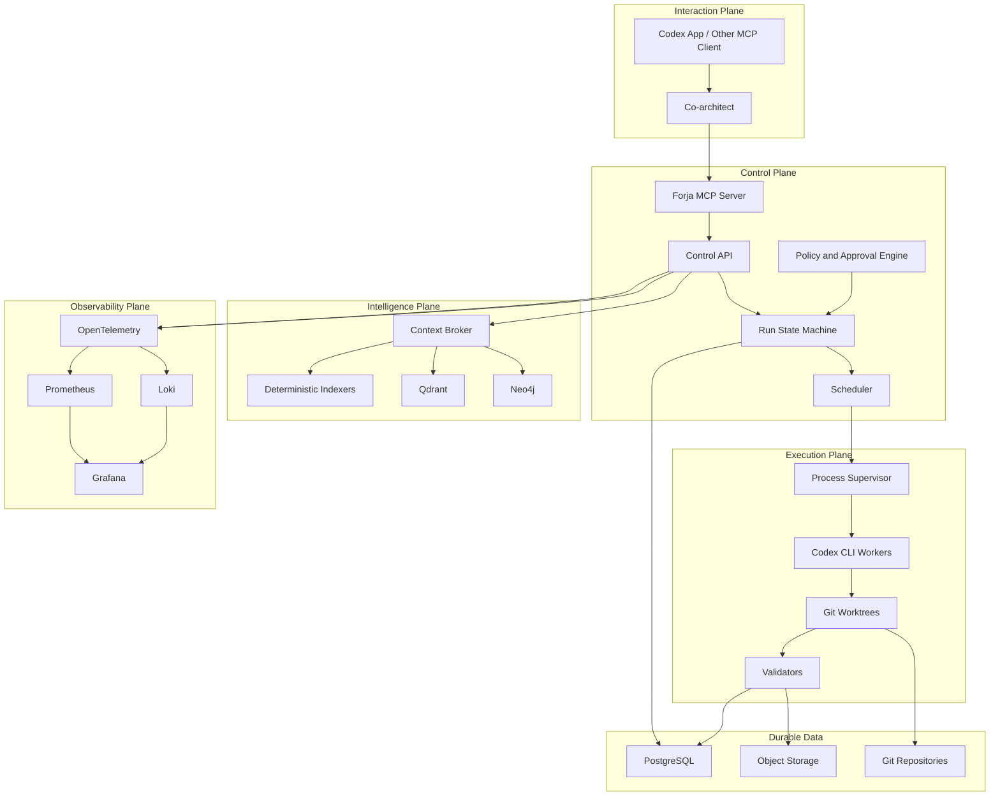

# System Architecture

Status: Proposed

## Overview

Forja is divided into five planes:

| Plane | Responsibility |
| --- | --- |
| Interaction Plane | Human conversation, Sprint proposal, approvals, and status |
| Control Plane | Scheduling, policy, state transitions, leases, budgets, and recovery |
| Execution Plane | Agent processes, tools, worktrees, tests, and evidence |
| Intelligence Plane | Deterministic indexes, retrieval, graph traversal, and context assembly |
| Observability Plane | Metrics, logs, traces, alerts, and operational dashboards |



## Deployment Shape

The first production shape should be a **modular monolith**, not a fleet of
microservices:

```text
forjad
  ├── MCP server
  ├── control API
  ├── scheduler
  ├── policy engine
  ├── outbox dispatcher
  ├── worker supervisor
  ├── context broker
  └── telemetry exporters
```

PostgreSQL, Qdrant, Neo4j, object storage, and observability services remain
separate infrastructure processes.

This boundary gives Forja transactional simplicity while preserving replaceable
adapters.

## Core Invariants

- A run has one durable state at a time.
- Every state transition emits an immutable event.
- Every write target has at most one active lease.
- Workers receive a bounded task contract, not unrestricted project authority.
- Model output cannot directly authorize model execution.
- Retries are idempotent or explicitly compensating.
- Qdrant and Neo4j projections can be deleted and rebuilt.
- PostgreSQL projection cursors reveal stale or incomplete derived stores.
- Completion requires the declared acceptance evidence.

## Repository Layout Target

```text
cmd/
  forja/
  forjad/
internal/
  api/
  mcp/
  controlplane/
  scheduler/
  policy/
  workers/
  worktrees/
  validation/
  context/
  store/
  observability/
adapters/
  codex/
  qdrant/
  neo4j/
  objectstore/
  indexers/
migrations/
schemas/
tests/
```

## Why Go

The control plane is a long-running process supervisor and scheduler. Go offers
strong cancellation semantics through contexts, lightweight concurrency,
simple static deployment, predictable memory use, and mature PostgreSQL,
OpenTelemetry, Prometheus, and MCP libraries.

Language-specific indexing may use other runtimes. For example, the TypeScript
Compiler API should produce richer TypeScript type evidence than a generic Go
parser. Such indexers are adapters with versioned output contracts, not
alternative control planes.

