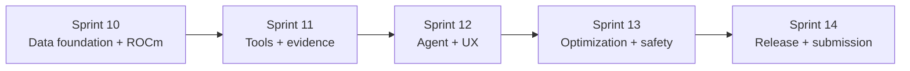

# Sprints 10-14: Forja Alpha Production Plan

Status: Active. Sprint 09 is closed. Sprint 10 is the current implementation
Sprint. These Sprints finish Forja Alpha as a local, private, evidence-grounded
investment-research agent for AMD AI DevMaster Hackathon Track 2 without
weakening the neutral Forja kernel.

The canonical source and storage design is defined in the
[Forja Alpha data architecture](../02-architecture/FORJA_ALPHA_DATA_ARCHITECTURE.md).

## Product Outcome

Forja Alpha must let a researcher ask a financial question in natural language,
watch a local AMD Radeon agent create and execute a bounded plan, inspect every
tool call and source, continue the conversation with governed memory, and
receive a cited research memo. It analyzes reported financial performance,
factor sensitivity, and public institutional disclosures. It does not predict
prices, place trades, or present correlation as causation.

The primary demonstration question is:

> Compare NVIDIA, Microsoft, and Alphabet using point-in-time filings, explain
> changes in operating quality and cash conversion, estimate their historical
> sensitivity to the US 10-year real yield, and show the evidence and limits of
> every conclusion.

## Competition Boundary

- Final submission deadline: 2026-08-06 12:59 America/Sao_Paulo.
- Core language-model and embedding inference runs locally on AMD Radeon and
  ROCm. Remote APIs are not inference fallbacks in the competition profile.
- Public data may be downloaded through governed ingestion jobs. The recorded
  demo executes from hash-pinned local snapshots and survives source outages.
- The product visibly demonstrates local RAG, tool invocation, multi-step
  planning, multi-turn memory, and permission and privacy controls.
- The Radeon Cloud profile uses persistent PVC storage, SSH, reproducible
  setup, and explicit GPU/runtime evidence.
- Source, README, project PDF, three-to-five-minute demo, and submission pull
  request are in English.
- The final AMD pull request title follows
  `Track 2, <Team Name>, Forja Alpha`.

## Alpha Data Spine

Forja Alpha is not a chatbot with files attached. It is a data-and-agent system
where each store has a narrow job:

| Layer | Store | Responsibility | Not responsible for |
| --- | --- | --- | --- |
| Source bytes | Object storage on persistent PVC | Immutable SEC, Treasury, FRED, market, 13F, model, benchmark, memo, and evidence artifacts by content hash | Query authority or semantic ranking |
| Canonical authority | PostgreSQL | Identity, lineage, point-in-time facts, exact decimals, permissions, sessions, tool receipts, claims, citations, and analysis state | Long narrative retrieval or graph path expansion |
| Narrative discovery | Qdrant | Local embeddings for filing text, notes, risk factors, accounting policies, methods, and generated evidence summaries | Numeric truth, identity resolution, or permission decisions |
| Evidence graph | Neo4j | Proven relationships among issuers, filings, documents, concepts, facts, metrics, series, holdings, analyses, claims, and source objects | Storing raw data bodies or making semantic guesses authoritative |
| Analytical execution | Typed Go tools | Recomputable fundamentals, factors, holdings, filing comparisons, and validation receipts | Free-form interpretation |
| Local inference | Radeon/ROCm models | Planning, natural-language synthesis, and bounded explanation from approved context | Creating canonical facts or authorizing privileged actions |
| Observability | Prometheus, Loki, Grafana, Tempo | Metrics, content-free logs, traces, receipts, latency, GPU/runtime status, and failure taxonomy | Private prompt or source-body storage |

Every source observation records publication, availability, ingestion, and
validity time separately. Research always declares an `as_of` timestamp.
Qdrant can discover text, and Neo4j can show paths, but PostgreSQL and typed
tools decide whether a claim is allowed, current, and computable.

## Cross-Sprint Invariants

- PostgreSQL is canonical. Object storage preserves source bytes and generated
  evidence. Qdrant and Neo4j are rebuildable projections.
- Raw source bytes are immutable and content-addressed. Corrections and amended
  filings create new versions; they never rewrite history.
- Numeric facts are selected and calculated by typed tools, not semantic
  retrieval or model arithmetic.
- Model output cannot approve its own tool access, mutate canonical source
  facts, expand scope, or silently call a remote provider.
- Every claim in a completed memo resolves to source facts, deterministic
  calculations, statistical estimates, or an explicit unsupported gap.
- Public telemetry contains identifiers, states, counts, timings, and hashes,
  but not private prompts, memory bodies, credentials, or licensed data.

## Critical Path

No Sprint may claim completion from documentation alone. Its exit requires the
specified runtime evidence and a clean-checkout reproduction.

## Sprint 10: Data Foundation and Radeon Runtime

**Outcome:** establish the minimum credible financial data foundation and the
local AMD Radeon inference boundary.

### User-Visible Increment

The web interface shows local model health, local embedding health, GPU/runtime
receipt status, covered companies, available data windows, and source-backed
filing and macro timelines. It does not yet generate an analytical memo.

### Data We Extract

- SEC company tickers, CIKs, issuer names, ticker mappings, and exchange
  aliases for Apple, Microsoft, Alphabet, Amazon, NVIDIA, Meta Platforms, and
  Tesla.
- SEC submissions metadata for 10-K, 10-Q, and amendments, including
  accession, form, report period, filed time, accepted time, and document URLs.
- SEC Company Facts and filing XBRL facts for the bounded accounting metric
  registry.
- Complete filing documents and structured payloads as immutable source
  objects before parsing.
- Treasury nominal and real yield snapshots, with initial priority on the
  10-year real yield required by the demo.
- FRED/ALFRED vintage snapshots for a small approved macro registry.
- Provider-neutral adjusted daily market data, preferably from a reviewed
  licensed adapter or a hash-pinned CSV fallback.
- Optional 13F manager allowlist only after the disclosure and delay contract is
  explicit.

### Database Work

- [x] Add PostgreSQL migrations for Alpha source systems, source objects,
  issuers, securities, identifiers, filings, XBRL facts, metric observations,
  time series, analysis runs, 13F holdings, research sessions, tool
  invocations, claims, and claim evidence.
- [x] Add deterministic SEC identity registry and idempotent SQL seed for the
  Magnificent Seven.
- [x] Convert the deterministic SEC seed into a snapshot-aware identity adapter
  that stores source hash, source limitations, ingestion run, and object
  lineage.
- [x] Add a local SEC submissions snapshot adapter that validates issuer CIK
  and ticker, filters 10-K/10-Q amendment forms, records source-object
  lineage, and upserts the initial filing timeline.
- [x] Add a local SEC Company Facts snapshot adapter that validates CIK,
  records source-object lineage, and publishes sanitized coverage metadata
  before metric mapping.
- [x] Persist initial Company Facts raw rows into taxonomy, concept, context,
  and fact tables with deterministic IDs and source-object lineage.
- [x] Add the initial reported metric registry and issuer-scoped reviewed
  US-GAAP concept mappings for the bounded accounting metrics.
- [ ] Store accounting values as exact decimals with explicit units, scales,
  currencies, periods, fiscal frames, dimensions, and filing identities.
- [ ] Represent `observed_at`, `period_start`, `period_end`, `filed_at`,
  `published_at`, `available_at`, `ingested_at`, and supersession
  independently.
- [ ] Quarantine ambiguous dimensions, unsupported units, duplicate contexts,
  impossible periods, and unmapped custom concepts rather than guessing.
- [ ] Add point-in-time views that select only data available at the requested
  research timestamp.

### Runtime Work

- [x] Define the Radeon Cloud template procedure with persistent PVC, SSH, the
  recommended base image, public Git checkout, and no model weights committed.
- [x] Add `schemas/radeon-runtime-receipt.schema.json`.
- [x] Add `scripts/capture_radeon_runtime_receipt.py`.
- [x] Add `docs/06-operations/RADEON_CLOUD_RUNTIME.md`.
- [x] Add a loopback-only local OpenAI-compatible embedding provider.
- [ ] Capture a real Radeon Cloud runtime receipt and keep raw artifacts
  outside Git.
- [ ] Deploy at least two open-weight instruction-model candidates locally and
  select one with a frozen task set.
- [ ] Deploy and benchmark a local embedding model on the Radeon profile.
- [ ] Prove zero remote core-inference calls in the competition profile.
- [ ] Prove source, configuration, and evaluation recovery after instance
  destruction without committing model weights or secrets.

### Sprint 10 Exit Gate

- A clean Radeon instance serves verified local model and embedding endpoints.
- The exact competition profile performs zero remote inference calls.
- Every Magnificent Seven issuer resolves deterministically to SEC identity.
- At least the latest 10-K and two 10-Q periods per issuer are preserved and
  queryable point-in-time with raw-to-canonical lineage.
- Treasury/FRED and approved market observations expose availability and
  revision semantics.
- Destroying the instance loses no committed code, required receipts, or
  persistent data snapshot.

## Sprint 11: Deterministic Tools and Evidence Fabric

**Outcome:** transform canonical data into recomputable financial tools and
minimal context packs that a local model can safely use.

### User-Visible Increment

The interface runs one approved deterministic analysis at a time and shows its
inputs, formula, output, citations, freshness, diagnostics, and limitations.

### Tools We Build

- [ ] `filings.timeline`: issuer filing history, amendment chain, source
  availability, and document closure.
- [ ] `filings.compare`: section-level filing changes and disclosure deltas.
- [ ] `fundamentals.compute`: revenue growth, margin, operating quality, cash
  conversion, capital intensity, leverage, dilution, and free cash flow.
- [ ] `factors.estimate`: aligned returns, real-yield sensitivity, rolling OLS,
  Ridge, robust errors, diagnostics, and stability checks.
- [ ] `holdings.compare`: manager positions, changes, concentration, overlap,
  and filing-delay disclosure.
- [ ] `evidence.pack`: create bounded evidence packs with source hashes,
  canonical IDs, result hashes, and citation anchors.

### Qdrant Projection

- [ ] Chunk filing sections, notes, accounting policies, risk disclosures, and
  method documentation without embedding numeric tables as authority.
- [ ] Attach issuer, filing, form, section, source hash, filed/available time,
  lifecycle, access scope, concept references, and graph IDs to every point.
- [ ] Generate embeddings locally on Radeon and record model, vector version,
  chunking version, and projection receipt.
- [ ] Implement exact, dense, sparse, and weighted-hybrid retrieval baselines.
- [ ] Resolve every candidate against PostgreSQL authority before text enters a
  context pack.

### Neo4j Projection

- [ ] Add idempotent nodes for issuer, security, filing, document, section,
  concept, fact, metric, series, observation, manager, holding, analysis,
  claim, and source object.
- [ ] Add evidence-classified edges such as `FILED`, `CONTAINS`, `REPORTS`,
  `NORMALIZES_TO`, `DERIVED_FROM`, `USES_SERIES`, `HOLDS`, and `SUPPORTED_BY`.
- [ ] Bind every edge to canonical IDs, source hashes, projector version, and
  evidence class.
- [ ] Implement checkpoints, drift detection, full rebuild, path allowlists,
  hop budgets, and stale-projection fallback.

### Context Broker

- [ ] Define typed context requests with user scope, research time, source
  budget, token budget, and required evidence classes.
- [ ] Route exact numeric questions to PostgreSQL/tools and narrative questions
  to Qdrant plus bounded Neo4j paths.
- [ ] Deduplicate overlapping excerpts, preserve counterevidence, and report
  missing or conflicting evidence.
- [ ] Emit content-free retrieval receipts for discovery, canonical resolution,
  selection, rejection, freshness, graph traversal, and final context size.

### Sprint 11 Exit Gate

- Every displayed calculation is independently recomputable from cited inputs.
- Every narrative excerpt resolves to a current, permitted source object.
- Qdrant and Neo4j can be destroyed and rebuilt without canonical data loss.
- Point-in-time tests reject look-ahead facts, revised macro values, and late
  filings unavailable at the requested timestamp.
- The primary demo question produces a complete evidence pack before LLM
  interpretation is enabled.

## Sprint 12: Local Agent and Research Workspace

**Outcome:** convert the foundation into a complete local research agent with
planning, RAG, tools, memory, permissions, and a fluid web experience.

### User-Visible Increment

The researcher asks the primary question, watches the plan and local tool calls
execute, inspects evidence, receives a cited memo, asks a follow-up, and can
delete the conversation and promoted memory.

### Agent Orchestration

- [ ] Replace the static preview plan with a typed local-model planner whose
  output is schema-validated before execution.
- [ ] Restrict plans to allowlisted tools, bounded companies, approved windows,
  budgets, dependencies, stop conditions, and retry policies.
- [ ] Route every tool request through MCP capability, identity, scope,
  approval, lease, and audit boundaries.
- [ ] Execute independent read-only steps concurrently while preserving a
  deterministic dependency graph and cancellation semantics.
- [ ] Add verify, repair, and fail-closed paths for malformed plans, missing
  evidence, stale data, tool errors, timeout, and local-model failure.

### Memo Composition

- [ ] Define a memo contract separating reported facts, calculated metrics,
  statistical estimates, interpretation, counterarguments, and gaps.
- [ ] Pass only the bounded evidence pack to the local writer model.
- [ ] Verify citations, numbers, units, periods, company identities, and claim
  support mechanically before releasing a memo.
- [ ] Reject unsupported causal language, forecasts presented as facts, stale
  evidence, and outputs that omit statistical limitations.
- [ ] Preserve the complete private memo as an access-controlled artifact and
  expose only content-free telemetry.

### Memory and Privacy

- [ ] Persist conversations, messages, citations, working summaries, memory
  candidates, and approved memory through governed stores.
- [ ] Promote durable memory only through explicit policy or user action.
- [ ] Scope retrieval by user, workspace, research session, issuer, and source
  lifecycle before embedding or graph traversal.
- [ ] Implement redaction, retention, export, deletion, tombstone, and derived
  Qdrant/Neo4j cleanup behavior.
- [ ] Add prompt-injection, indirect-injection, cross-session leakage,
  memory-poisoning, tool-abuse, and approval-bypass tests.

### Product Experience

- [ ] Build a polished web interface inspired by professional coding-agent
  tools: conversation rail, plan timeline, tool console, evidence drawer, data
  cards, and memo panel.
- [ ] Stream plan, step, tool, evidence, verification, and completion events.
- [ ] Add source cards, citation inspection, formula drill-down, data freshness,
  runtime/GPU status, cancellation, retry, and degraded-state UI.
- [ ] Add conversation history and follow-up flow without exposing hidden
  chain-of-thought; show concise reasons, evidence, and decisions instead.
- [ ] Meet keyboard, IME, responsive, screen-reader, focus, contrast, and error
  recovery requirements on desktop and mobile.

### Sprint 12 Exit Gate

- The product visibly demonstrates all five Track 2 capabilities: RAG, tools,
  planning, memory, and permission/privacy controls.
- The primary scenario and four adversarial variants complete with local
  Radeon inference and no remote core dependency.
- Every released material claim has a valid citation or deterministic result.
- Cancellation, restart, source outage, tool failure, and local-model failure
  produce clear bounded states without fabricated completion.
- A judge can operate the full scenario from the web interface alone.

## Sprint 13: Evaluation, ROCm Optimization, and Safety Closure

**Outcome:** improve quality, speed, and stability using reproducible evidence
rather than demo-specific tuning.

### Evaluation Corpus

- [ ] Freeze public, tuning, untouched holdout, OOD, stale, adversarial, and
  end-to-end suites across filings, fundamentals, factors, holdings, retrieval,
  planning, tools, memory, permissions, and memo verification.
- [ ] Generate cases from source templates while preventing prompt, answer,
  source-period, and issuer leakage between partitions.
- [ ] Add mechanically graded numeric and contract cases plus citation and
  evidence-grounding review rubrics.
- [ ] Record dataset version, generation lineage, split manifest, hashes,
  licenses, and private/public boundary.

### ROCm Optimization

- [ ] Establish FP16/BF16 baselines for instruction and embedding models.
- [ ] Evaluate Radeon-compatible quantization or distillation and record model
  revisions, artifacts, hashes, conversion tools, and runtime flags.
- [ ] Tune context length, prefill, batching, concurrency, prefix caching,
  decoding, memory utilization, and tool parallelism against held-out tasks.
- [ ] Measure startup, model load, TTFT, inter-token latency, tokens/second,
  GPU utilization, peak VRAM, p50/p95 response time, and end-to-end duration.
- [ ] Separate ingestion, retrieval, graph, tool, model, verification, and UI
  latency in every benchmark.

### Safety and Reliability

- [ ] Measure task completion, citation precision/recall, numeric exactness,
  required-source recall, plan validity, tool-call validity, unsupported-claim
  rate, stale rejection, and cross-scope leakage.
- [ ] Compare baseline and optimized profiles with confidence intervals and
  declared non-inferiority margins.
- [ ] Run load, soak, cancellation, restart, malformed output, dependency
  outage, disk pressure, and model-crash tests on the exact Radeon profile.
- [ ] Test prompt injection in filings, retrieved text, memory, and tool output.
- [ ] Publish sanitized raw receipts, benchmark tables, charts, and known
  limitations without exposing private cases or prompt bodies.

### Sprint 13 Exit Gate

- The selected profile improves a declared GPU or end-to-end metric without
  crossing task-success, citation, numeric, or safety regression gates.
- Holdout data remains inaccessible to runtime agents and tuning prompts.
- The full primary scenario meets a frozen interaction SLO on Radeon Cloud.
- Every public performance and quality claim is reproducible from versioned
  configuration and sanitized evidence.

## Sprint 14: Pilot, Release, and AMD Submission

**Outcome:** ship a polished, reproducible Forja Alpha release and a complete
Track 2 submission.

### Production Rehearsal

- [ ] Run the primary scenario and a second holdings-focused scenario from a
  clean Radeon Cloud template and clean source checkout.
- [ ] Rehearse first startup, warm startup, cancellation, restart, PVC recovery,
  data restore, projection rebuild, local-model outage, and source outage.
- [ ] Verify that no undocumented file, local cache, private credential, or
  manual database repair is required.
- [ ] Audit egress and prove zero remote core inference in the exact recorded
  release profile.
- [ ] Record intervention, degraded paths, retries, queue time, context size,
  GPU metrics, task quality, and final evidence hashes.

### Packaging and Documentation

- [ ] Publish one-command setup and startup paths plus a pinned Radeon Cloud
  template, dependency lockfiles, model-acquisition guide, and sample data path.
- [ ] Publish an English README covering architecture, requirements, local
  privacy, sources, licenses, setup, use, evaluation, limitations, and recovery.
- [ ] Publish the English project-specification PDF with application scenario,
  architecture diagram, capabilities, models, deployment, data lineage,
  privacy, and ROCm optimization evidence.
- [ ] Record a three-to-five-minute English demo showing actual Radeon GPU
  execution, question, plan, tools, evidence, memo, follow-up, privacy control,
  and measured performance.
- [ ] Publish an English presentation or poster focused on practical value,
  local privacy, evidence grounding, deterministic finance, and GPU results.
- [ ] Audit repository history and artifacts for secrets, private corpora,
  licensed payloads, personal paths, unsupported claims, and stale screenshots.

### Submission and Closure

- [ ] Fork the official AMD repository and open the final pull request titled
  `Track 2, <Team Name>, Forja Alpha` with every required link public.
- [ ] Recheck the official rules and submission guide on the submission day;
  record any material rule drift before changing the release.
- [ ] Tag the release only after the exact commit passes quality, security,
  clean deployment, data recovery, benchmark, documentation, and demo gates.
- [ ] Preserve source and receipts in Git, PVC, and independent backup, then
  destroy idle Radeon instances to stop credit consumption.

### Sprint 14 Exit Gate

- A new Radeon environment reproduces the submitted workflow from documented
  commands and approved data snapshots.
- The video proves local core inference and measured optimization on AMD
  Radeon/ROCm through a fluid judge-visible product.
- Source, README, PDF, video, and presentation links are public and in English.
- The release contains no secret, private evaluation body, prohibited data, or
  remote core-inference dependency.
- Independent evidence supports every published capability, benchmark, and
  data-quality claim.

## Deferred Beyond the Submission

- Real-time trading feeds, order execution, portfolio recommendations, price
  prediction, options analytics, and autonomous financial decisions.
- Universal issuer coverage before the Magnificent Seven data contracts and
  quality gates are stable.
- News and social-media ingestion without a reviewed license and provenance
  policy.
- Treating 13F filings as current positions or complete portfolio exposure.
- Promoting Alpha-specific finance contracts into the neutral Forja kernel
  without evidence from another vertical.
